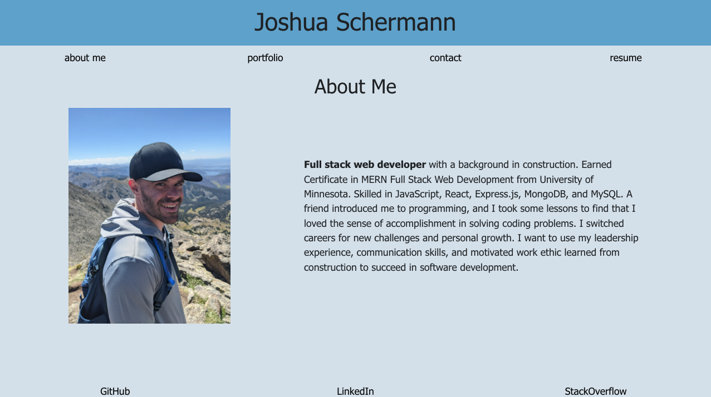

# React Porfolio
Portfolio of my featured projects built with React.js

Deployment: https://josh2100.github.io/react-portfolio/

## Table of Contents

- [Installation](#installation)
- [Usage](#usage)
- [License](#license)
- [Contributions](#contributions)
- [Technologies](#technologies)
- [Credits](#credits)
- [Questions](#questions)

## Installation

Use "npm install" to install required modules for this application. Run "npm run start" to run React application. 

## Usage

Click "about" to view a short bio. Click "portfolio" to view featured projects. Send a message by clicking the "contact" tab. View or download resume by finding the "resume" tab. 

## License

This project is licensed under the MIT license.

## Contributions

Fork the project and create a pull request. Let me know how you think you can contribute!

## Technologies

Created with JavaScript, React.js and Node.js.

## Credits

Created by Joshua Schermann

## Questions

Post an issue if you see a bug or suggested improvement.